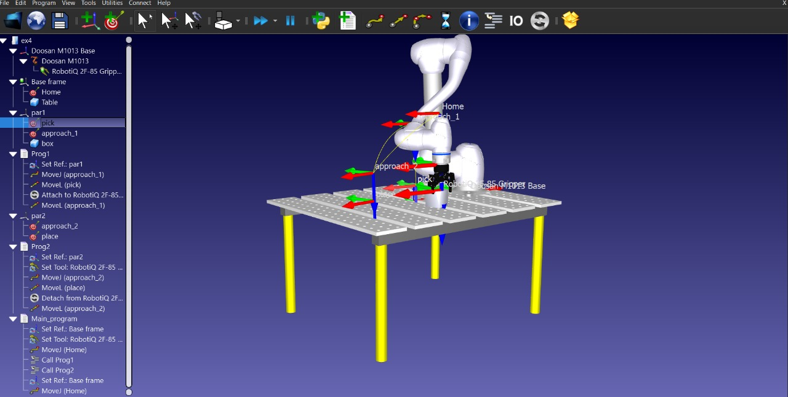
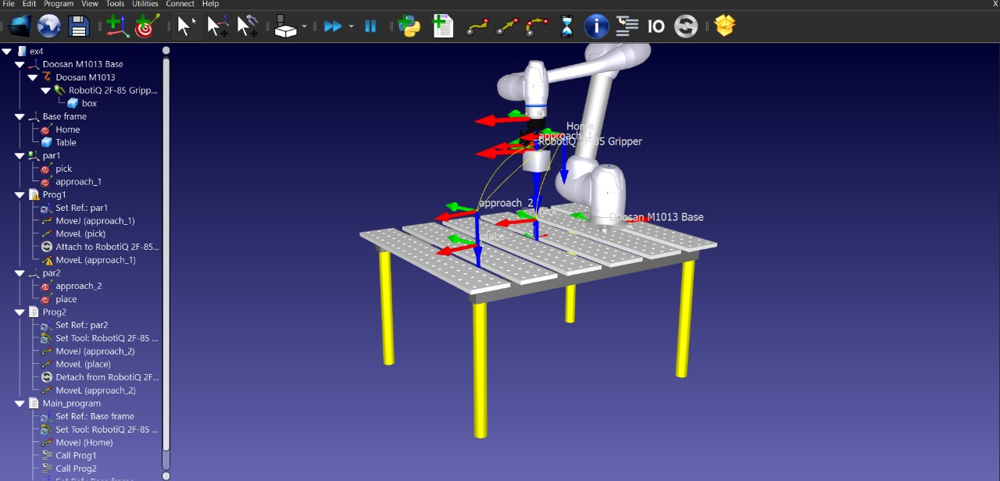

# Experiment-02-Introduction-to-Roboanalyzer-
## AIM: 
To Design & simulate an environment for pick & place operations with Industrial Robot using Robo DK software
## COMPONENTS REQUIRED:
1.RoboDK

## THEORY: 

### Types of pick and place robots:
There are several pick and place robot types and components, including:

Robotic arm – Robotic arms are the most common type of pick and place robots. A 5-axis robotic arm robot can be used for standard pick and place applications where objects are picked up and moved to other locations in a single plane. A 6-axis robotic arm robot is used for more complex applications, such as when objects must be twisted or re-oriented before being placed in another location.

Cartesian – Like a 6-axis robotic arm, Cartesian robots work in multiple planes. These robots move in three orthogonal axes (X, Y and Z) using Cartesian coordinates. They can be constructed with any type of linear actuator and several types of drive mechanisms such as belt, ball or lead screw mechanisms. They typically have better positioning accuracy compared to 6-axis robotic arms.

Delta – Often used in applications where robots pick items in groups and place them in assembly patterns or containers, Delta robots have advanced vision technologies that enable them to distinguish various sizes, shapes and colors. There are several configurations of Delta robots, but most have three arms that operate on four axes. They have heavy motors affixed to a frame, with lightweight arms connected to linking rods with joints at either end of each arm (typically ball joints) to allow movement.

Fast pick – Fast pick robots are ideal for use in medium- and high-volume applications with high-velocity SKUs. Fast pick robots fully automate the picking process, freeing up the human workforce to focus on higher-impact activities. They’re ideal for fast-moving “top-off” items, such as promotional items added to orders or batteries. These robots can pick up to 300 SKUs per hour from a pool of up to 8 SKUs.

Collaborative – Collaborative robots augment the work of humans by leading associates to pick locations and guiding associates through each task. By optimizing routes in real-time and keeping associates on task, collaborative robots help associates work more efficiently.

### Applications for pick and place robots:
Pick and place robots are often used in manufacturing but are also used in applications such as packaging, bin picking and inspection. Here’s a look at a few of the most common applications for pick and place robots and how they’re used.

Assembly – Pick and place robots used in assembly applications grab incoming parts from one location, such as a conveyor, and place or affix the part on another piece of the item. The two joined parts are then transported to the next assembly area.

Packaging – Pick and place robots used in the packaging process grab items from an incoming source or designated area and place the items in a packaging container.

Bin picking – Pick and place robots used in bin picking applications grab parts or items from bins. These pick and place robots typically have advanced vision systems allowing them to distinguish color, shape and size to pick the right items even from bins containing randomly mixed items. These parts or items are then sent to another location for assembly or packaging.

Inspection – Pick and place robots used for inspection applications are equipped with advanced vision systems to pick up objects, detect anomalies and remove defective parts or items by placing them in a designated location.
## PROCEDURE:
### Step1:
Select a robot New robots can be added from a local drive or from the online library

### Step2:
Reference frames can also be moved in the main screen by holding the Alt key, or selecting the corresponding button in the toolbar.

### Step3:
Add a Reference Frame A Reference frame allows placing objects with respect to a robot or with respect to other objects in the 3D space (including position and orientation).

### Step4:
Select Program Add Reference Frame Alternatively, select the equivalent button in the toolbar Double click the reference frame (on the tree or on the 3D geometry on the main screen) to enter the coordinates shown in the image (X,Y,Z position and Euler angles for the orientation).

### Step5:
Create Targets Robot positions are recorded as Targets. Follow these steps to create two targets as a new home target and approach target respectively.

### Step6:
 Select Program Teach Target (Ctrl+T) or the appropriate button in the toolbar to create a new target Rename the target to Approach.
## PROGRAM:
```
Developed by :MS.JEEVA
Reg no: 212221230040
def Main_program():
  
  #--------------------------
  # Add your default header and subprograms here
  # For example, to drive a gripper as a program call:
  # def Gripper_Open():
  #   set_digital_output(3, 1)
  #
  # def Gripper_Close():
  #   set_digital_output(3, 0)
  #
  # Example to drive a spray gun:
  def SprayOn(value):
    # use the value as an output:
    DO_SPRAY = 5
    if value == 0:
      set_digital_output(DO_SPRAY, 0)
    else:
      set_digital_output(DO_SPRAY, 1)

  #--------------------------
  
  # Subprogram Prog1
  def Prog1():
    set_ref_coord(set_user_cart_coord(posx(-400.000,200.000,0.000,0.0000,0.0000,0.0000),ref=DR_BASE))
    movej(posj(184.368000,-10.311700,125.917000,2.469090,64.047300,190.975000))
    movel(posx(-7.112,-201.301,39.753,-95.0554,177.7496,-87.3744))
    # Attach to RobotiQ 2F-85 Gripper (Open)
    movel(posx(4.973,-200.265,400.000,-95.0570,177.7496,-87.3760))
  
  # Subprogram Prog2
  def Prog2():
    set_ref_coord(set_user_cart_coord(posx(-800.000,-200.000,0.000,0.0000,0.0000,0.0000),ref=DR_BASE))
    movej(posj(195.399000,30.638700,84.247900,2.474640,64.933900,186.677000))
    movel(posx(0.000,0.000,70.000,-79.6990,177.7496,-87.3760))
    # Detach from RobotiQ 2F-85 Gripper (Open)
    movel(posx(-0.913,5.022,199.900,-79.6990,177.7496,-87.3760))
  
  
  # Main program:
  # Program generated by RoboDK v5.5.0 for Doosan M1013 on 10/11/2022 10:12:42
  # Using nominal kinematics.
  set_ref_coord(set_user_cart_coord(posx(-400.000,0.000,0.000,0.0000,0.0000,0.0000),ref=DR_BASE))
  # TCP: posx(0.000,0.000,130.000,0.0000,0.0000,0.0000)
  set_tcp("RobotiQ 2F-85 Gripper (Open)")
  movej(posj(182.952000,-12.827900,121.319000,2.354070,71.210500,189.881000))
  Prog1()
  Prog2()
  movej(posj(182.952000,-12.827900,121.319000,2.354070,71.210500,189.881000))
  # End of main program
  
Main_program()
```
## OUTPUT:
### Pick and Place Simulation:


### Pick:

### Place:


## RESULT :  
An environment for pick & place operations with Industrial Robot has been created and the simulation has been completed successfully using Robo DK software.
